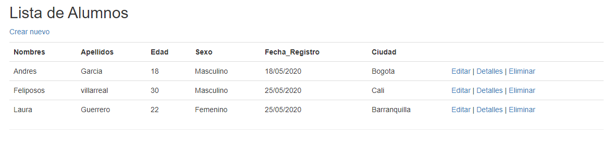

# Asp.Net-MVC-Entity-Framework
Asp.Net MVC + Entity Framework + SQL SERVER 

#Proyecto alumno

Se creo una base de datos en SQL server con las tablas alumno y ciudad en cual se une por medio de Entity framework a visual studio.
se crea controladores vistas y el modelo de la DB. (MVC)
se utiliza la primary key de ciudad para identificar a cual ciudad pertence cada alumno


el patron (MVC) de alumno permite Editar-eliminar-detalles para cada uno de los alumnos y crer uno nuevo usando Html y razor, por medio de tokens tambien se valida que el combo del nuevo alumno sea correcto garantizando el encapsulamiento.  



se hizo uso de Linq para realizar las busquedas y modificaciones en la base

```
plantilla utilizada (Web Asp.net MVC (.net framwork) C#) 
```


